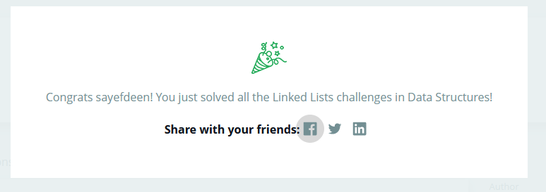

# Hacker Rank Questions On LinkedList

|Q.Name   |Q.Link   |Q.Solution   |Q.Description   |
|:-:|:-:|:-:|:-:|
|Q.1   |[Cycle Detection](https://www.hackerrank.com/challenges/detect-whether-a-linked-list-contains-a-cycle/problem)   |   |Cycle Detection|
|Q.2   |[Get Node Value](https://www.hackerrank.com/challenges/get-the-value-of-the-node-at-a-specific-position-from-the-tail/problem) |   |Get Node Value|
|Q.3   |[Inserting A Node DLL](https://www.hackerrank.com/challenges/insert-a-node-into-a-sorted-doubly-linked-list/problem)   |   |Insert A New Node DLL|
|Q.4   |[Remove Duplicate](https://www.hackerrank.com/challenges/delete-duplicate-value-nodes-from-a-sorted-linked-list/problem)   |   |remove Duplicate|
|Q.5   |[Inter section](https://www.hackerrank.com/challenges/find-the-merge-point-of-two-joined-linked-lists/problem)   |   |Find Merge Point of Two Lists|
|Q.6   |[Inter section](https://www.hackerrank.com/challenges/find-the-merge-point-of-two-joined-linked-lists/problem)   |   |Merge two sorted linked lists|
|Q.7   |[Reverse DLL](https://www.hackerrank.com/challenges/find-the-merge-point-of-two-joined-linked-lists/problem)   |   |Reverse A Double LinkedList|

